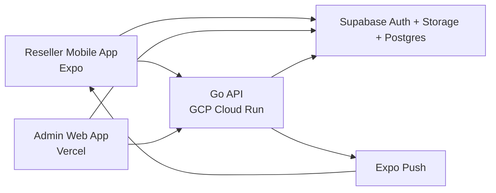

# Deployment Blueprint: Wholesale Fashion Reseller Platform MVP

**Feature**: Wholesale Fashion Reseller Platform MVP  
**Date**: 2026-04-19  
**Stage**: Early-stage / credit-optimized

## 1. Deployment Decision

Use a **GCP-first deployment strategy** for the MVP, optimized for startup
credits and low operational complexity.

### Why this is the current recommendation

- Google Cloud currently advertises larger early-stage startup credit coverage
  than the typical self-funded AWS path.
- The platform does not yet need complex multi-cloud, multi-region, or
  high-availability infrastructure.
- A simple managed deployment is better than prematurely building for scale.

## 2. Recommended MVP Hosting Layout

### Reseller Mobile App

**Platform**
- Expo-managed React Native app

**Delivery**
- iOS build distribution through Apple ecosystem
- Android build distribution through Google ecosystem

**Why**
- Lowest early-stage mobile ops burden
- Good fit for push notifications and rapid iteration

### Admin Web App

**Platform**
- Managed web hosting

**Recommended option**
- Vercel for fastest Next.js deployment path

**Alternative**
- Cloud Run if you want everything inside GCP from day one

### Go Backend API

**Platform**
- GCP Cloud Run

**Why**
- good fit for a single Go service
- scales down when idle depending on configuration
- simple deployment model
- startup credits can offset early usage well

### PostgreSQL

**Platform**
- managed Postgres

**Recommended early-stage options**
1. Supabase Postgres if you want the simplest combined auth/storage/database path
2. GCP Cloud SQL Postgres if you want tighter GCP alignment

**Recommendation**
- Start with **Supabase Postgres** if product velocity and lower ops matter most
- Start with **Cloud SQL** only if you explicitly want core data infra consolidated in GCP

### Auth and Storage

**Platform**
- Supabase Auth
- Supabase Storage

**Why**
- avoids early auth complexity
- gives social login foundation
- lowers operational burden

### Push Notifications

**Platform**
- Expo Push service

**Why**
- easiest notification path for Expo apps
- no need to build direct FCM/APNs handling initially

## 3. Recommended Actual Stack

For the MVP, I recommend:

- **Mobile**: Expo React Native
- **Admin**: Vercel-hosted Next.js
- **Backend**: Go API on GCP Cloud Run
- **Database**: Supabase Postgres
- **Auth/Storage**: Supabase
- **Notifications**: Expo Push

This is slightly hybrid, but it is the most practical low-cost early-stage shape.

## 4. Why This Hybrid Setup Is Acceptable

Normally I would avoid unnecessary provider spread, but here the tradeoff is
worth it because:

- Vercel is the smoothest admin deployment path for Next.js
- Supabase dramatically reduces auth/storage setup work
- Cloud Run is a very good home for a single Go API
- all three reduce early engineering and ops effort

This is still operationally manageable because the component count is low.

## 5. Environment Strategy

Use three explicit profiles from the beginning:

1. **local**
2. **stage**
3. **prod**

This keeps developer workflow clean while preparing stage and prod for remote
Kubernetes deployment.

### Profile Intent

#### `local`
- optimized for your MacBook
- runs the smallest possible subset locally
- prefers remote managed dependencies where possible
- used for feature development and focused debugging

#### `stage`
- remote environment for integration testing
- first Kubernetes deployment target
- mirrors production shape in a smaller, cheaper form
- used for QA, device testing, and pre-release validation

#### `prod`
- remote production Kubernetes environment
- stable public-facing deployment
- tuned for reliability and controlled scale-up over time

### Local Profile

- mobile and admin can run locally when needed
- Go API can run locally for focused backend work
- Supabase remains remote
- avoid running unnecessary local infra

### Stage Profile

- Go API deployed remotely on Kubernetes
- admin app deployed remotely
- Supabase stage project or isolated stage resources
- used for realistic end-to-end testing without stressing local hardware

### Prod Profile

- Go API deployed remotely on Kubernetes
- admin app deployed remotely
- production Supabase project/resources
- production notification and auth credentials

### Near-Term Recommendation

Even though the long-term direction is Kubernetes for stage/prod, the earliest
remote path can still begin with simple managed deployment and then move into
Kubernetes once the service shape is stable enough.

## 6. Deployment Diagram

## 7. Deployment Order

Deploy in this order:

1. Supabase project
   - auth providers
   - database
   - storage buckets

2. Go API
   - config
   - database connection
   - auth verification
   - core health endpoints

3. Admin web app
   - connect to production API
   - connect to auth flow

4. Mobile app
   - connect to production API
   - connect to auth
   - enable push token registration

5. Notification flow
   - validate end-to-end push delivery

## 8. Secrets and Config

At minimum, manage:

- Supabase URL
- Supabase anon/public client keys where required
- Supabase service credentials only in backend/admin-secure contexts
- Postgres connection string
- push notification credentials
- admin app environment variables
- mobile app public environment variables

## 9. Kubernetes Direction

### Stage and Prod Platform Direction

Stage and prod should be designed around Kubernetes deployments for the Go API.

#### Why
- cleaner path to later scale
- predictable deployment model between stage and prod
- easier future separation of API, workers, and supporting services

#### Early Principle
- keep Kubernetes usage minimal at first
- start with one API deployment, one service, and one ingress path
- avoid introducing extra workloads until needed

#### Suggested Progression
1. local profile for development
2. simple remote deployment for first smoke testing
3. stage Kubernetes deployment
4. prod Kubernetes deployment

The admin app may still remain on managed frontend hosting if that stays
operationally simpler than moving it into the cluster.

## 10. Cost-Control Rules

Use these rules until growth justifies more infrastructure:

- run one API service only
- run one database only
- no read replicas
- keep Kubernetes footprint minimal in stage and prod
- no message broker cluster
- no separate worker fleet unless background jobs become necessary
- keep media/storage lifecycle policies simple
- monitor only the most important cost drivers

## 11. Scale-Up Triggers

Upgrade the deployment model only when one of these becomes true:

- API latency becomes unstable under real traffic
- notification sending needs background workers
- database load becomes a bottleneck
- admin usage or buyer traffic needs stronger environment isolation
- uptime requirements justify staging, failover, or replicas

## 12. Later-Stage Evolution

When the product grows, the next likely infra upgrades are:

1. separate background worker service
2. managed cache
3. stronger observability stack
4. database replicas / better scaling
5. CDN and image optimization
6. more formal staging/pre-prod

## 13. Final Recommendation

For the MVP, deploy with:

- **local profile** for development on your Mac
- **stage/prod profiles** designed for remote Kubernetes deployment
- **Supabase** for auth, storage, and likely Postgres
- **Vercel** for the admin app
- **Expo** for mobile delivery and push

This gives the best balance of:
- low infra cost
- startup-credit leverage
- fast execution
- low ops burden
- clean path to stage/prod Kubernetes later
