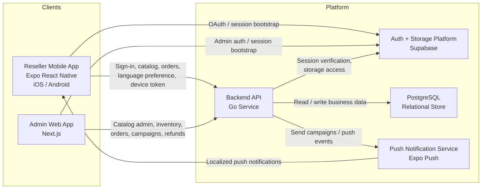
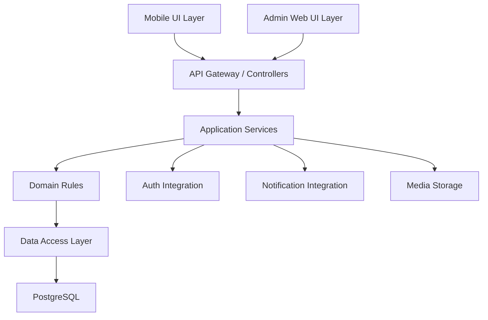
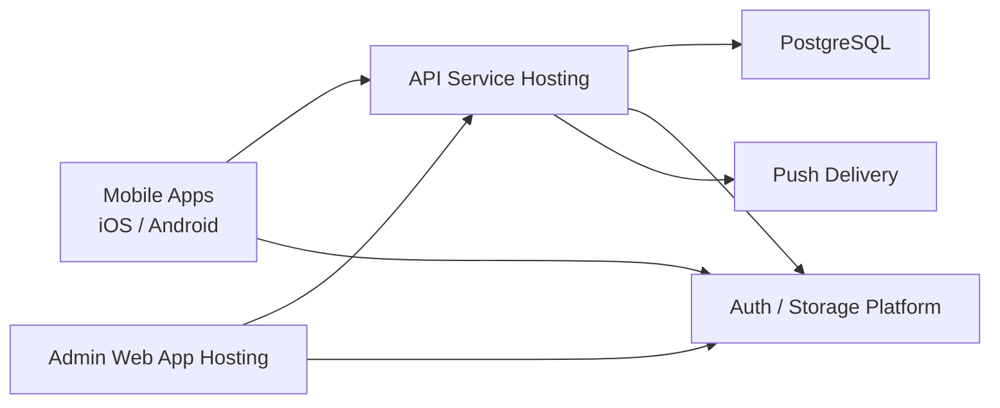

# High-Level Design: Wholesale Fashion Reseller Platform MVP

**Feature**: Wholesale Fashion Reseller Platform MVP  
**Branch**: `001-wholesale-fashion-platform`  
**Date**: 2026-04-19

## 1. Purpose

This HLD describes the high-level architecture for a wholesale-first fashion
platform with:

- a mobile-first reseller app for iOS and Android
- a web-first admin/inventory app
- a shared backend API
- shared data, auth, and notification infrastructure

The goal is to make the component boundaries, system interactions, and future
extensibility clear before implementation begins.

## 2. System Overview

The platform is composed of multiple major components:

1. **Reseller Mobile App**
   Used by reseller buyers for sign-in, language selection, catalog browsing,
   product discovery, ordering, and notification-driven re-engagement.

2. **Admin Web App**
   Used internally to manage catalog, pricing, inventory, orders, campaigns,
   and refund exceptions.

3. **Backend API**
   Central business layer for auth-aware access control, catalog, orders,
   notifications, and refunds.

4. **PostgreSQL Database**
   System of record for business entities such as buyers, products, orders,
   campaigns, and refund decisions.

5. **Auth/Storage Platform**
   External platform support for social login, session verification, and media
   storage.

6. **Push Notification Delivery Layer**
   Handles device token registration and delivery of multilingual mobile push
   notifications.

## 3. System Diagram

## 4. Component Breakdown

### 4.1 Reseller Mobile App

**Primary responsibilities**
- reseller authentication
- language selection and persistence
- localized catalog browsing
- product detail viewing
- order placement
- notification receipt and deep-link handling
- buyer-facing refund visibility

**Key modules**
- auth
- language and localization
- catalog
- orders
- notifications
- refunds
- session/app state

### 4.2 Admin Web App

**Primary responsibilities**
- admin authentication
- product creation and editing
- pricing and inventory updates
- order queue and order detail review
- multilingual campaign creation
- refund exception review and approval

**Key modules**
- auth shell
- product management
- inventory management
- order management
- campaign management
- refund operations

### 4.3 Backend API

**Primary responsibilities**
- role-based access control
- reseller and admin profile handling
- catalog APIs
- order APIs
- notification campaign APIs
- refund decision APIs
- validation and audit logging

**Core domain modules**
- auth
- users
- catalog
- orders
- notifications
- refunds

**Suggested internal structure**
- HTTP handlers
- application services
- domain models/rules
- repositories/data access
- integration clients

### 4.4 Database

**Primary responsibilities**
- persist reseller buyers and admins
- persist catalog and inventory data
- persist orders and refund decisions
- persist notification campaigns and message variants
- persist language preference and device token state

### 4.5 External Platform Services

**Auth + Storage**
- social login support
- session management support
- product/media storage support

**Push Delivery**
- device token delivery endpoint
- multilingual push notification dispatch

## 5. Logical Architecture

## 6. Key Flows

### 6.1 Reseller Sign-In and Catalog Flow

1. Buyer opens mobile app
2. Buyer signs in through supported auth provider or fallback login
3. Mobile app obtains/refreshes session
4. Buyer selects preferred language
5. Mobile app calls backend for profile and catalog data
6. Backend validates session and returns reseller-visible inventory

### 6.2 Admin Catalog Upload Flow

1. Admin signs into web app
2. Admin creates or updates a product
3. Web app submits catalog payload to backend
4. Backend validates product, MOQ, pricing, and availability rules
5. Backend stores product updates in database
6. Updated product becomes available in reseller catalog

### 6.3 Notification Campaign Flow

1. Admin creates campaign in web app
2. Admin provides English, Hindi, and Hinglish variants
3. Backend validates campaign relevance and required content
4. Backend resolves target audience and associated products
5. Backend sends notification payloads to push delivery layer
6. Buyer opens app through push deep link into relevant catalog/product context

### 6.4 Refund Decision Flow

1. Refund request or refund case enters operational workflow
2. Backend defaults decision path to store credit
3. Admin reviews exception cases in web app
4. Admin may approve payment-source refund when justified
5. Backend records decision, audit data, and buyer-visible outcome

## 7. Data Ownership

| Component | Owns |
|-----------|------|
| Mobile App | buyer UI state, session state, local navigation state |
| Admin Web App | admin UI state, campaign/product editing state |
| Backend API | business rules, validation, authorization, orchestration |
| PostgreSQL | source-of-truth business data |
| Auth Platform | identity/session primitives |
| Push Layer | notification delivery transport |

## 8. Security and Access Model

### Roles
- `buyer`
- `admin`

### Rules
- buyers can only access buyer-facing catalog, profile, orders, and notification-related endpoints
- admins can access operational endpoints for products, orders, campaigns, and refunds
- all business mutations flow through backend authorization checks
- direct client access to business tables is not part of the MVP design

## 9. Scalability and Extensibility

The architecture is intentionally split so future D2C expansion can be added
without collapsing the wholesale MVP boundaries.

**Extensible areas**
- add D2C storefront as another client surface
- add recommendation or trending automation later
- add WhatsApp/email notification channels later
- add richer pricing strategies such as tiered wholesale pricing
- add consumer-specific fit/sizing systems later

## 10. Early-Stage Cost Strategy

The MVP should be deployed with **low fixed cost** as a hard constraint.

### Principles
- prefer managed services over self-hosted ops-heavy systems
- use startup credits before committing to long-term infra spend
- keep the backend footprint small and centralized
- delay scale-oriented infrastructure until actual traffic justifies it

### Recommended Early-Stage Infra Shape
- one Go API deployment
- one managed PostgreSQL instance
- managed auth and object storage
- managed admin web hosting
- Expo push for notifications

### What We Intentionally Avoid Early
- Kubernetes
- service mesh
- dedicated queue clusters unless usage requires them
- separate read replicas
- multi-region active-active design
- custom auth infrastructure

### Later-Stage Expansion Path
When demand justifies it, the system can expand by:
- splitting background jobs from the main API
- adding caching and queue infrastructure
- scaling database capacity and replicas
- isolating notification workers
- adding CDN and image optimization layers
- introducing stronger observability and SRE controls

## 11. Deployment View

## 12. Recommended Initial Build Scope

For the first implementation increment, the architecture should be realized in
this order:

1. monorepo setup
2. auth + localization + core API foundation
3. reseller mobile MVP flow
4. admin catalog/order operations
5. notifications and refund operations

## 13. Summary

Yes, the system has multiple components, but they break down cleanly into:

- **2 user-facing surfaces**
  reseller mobile app and admin web app
- **1 shared backend**
  central business and orchestration layer
- **3 supporting infrastructure layers**
  database, auth/storage platform, and push delivery

This separation keeps the MVP focused while still giving us a strong path for
future D2C expansion.
